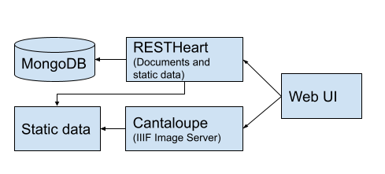

# Introduction

This projects indexes PDFs, splits them into images, makes the OCR text searchable, and the documents accessible with a IIIF viewer.
The stack consisting of MongoDB, RESTHeart, Cantaloupe, some Java tools, and a simple JavaScript viewer which uses Mirador.

# Architecture



# Build

The Java tool scan be built using maven with:

```
mvn package
```

# Process and import data

This should be able to handle a heirarchy of PDFs with a single pdf in a leaf directory. 
Requires Imagemagick, xmllint, and poppler-utils.

Grab the code:
```
git clone https://github.com/markpatton/oida-experiment
```

Make the PDFs available as `./data'. Then run a processing step to plit the pdfs into images and turn the OCR into an XML file.

```
./process_insys data/
```

Write out IIIF manifest and annotation files for the PDFs
```
java -jar oida-cli/target/oida-cli-0.1-jar-with-dependencies.jar write-iiif data/
```

Produce an ingest file for the database:
```
java -jar oida-cli/target/oida-cli-0.1-jar-with-dependencies.jar serialize-restheart data >data.json
```

# Start the stack

```
docker-compose up -d
```

Configure the database:
```
./setup_db.sh
```

Load the data

```
curl --user admin:secret -H "Content-Type:application/json" localhost:8080/oida/doc -d @data.json
```

# Web interface

Copy oida-ui into data/ to avoid some CORS issues.

```
cp -r oida-ui data/
```

Access the interface at `http://localhost:8080/data/oida-ui/index.html'.

